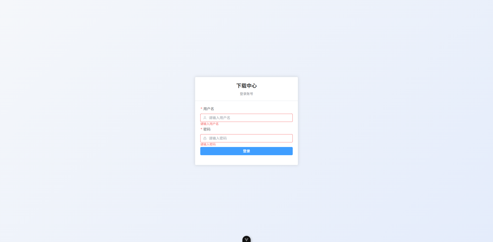
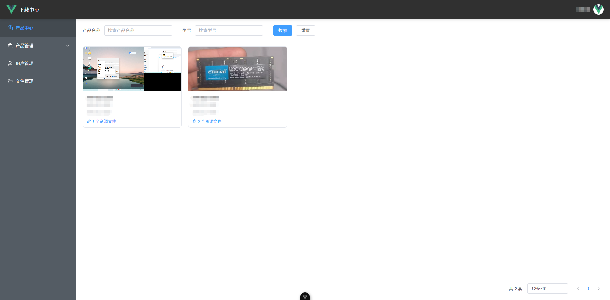
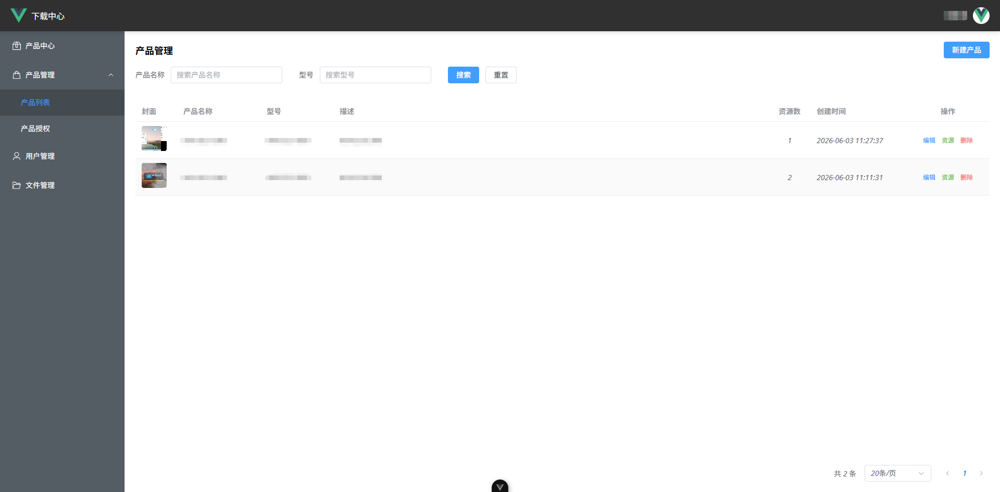
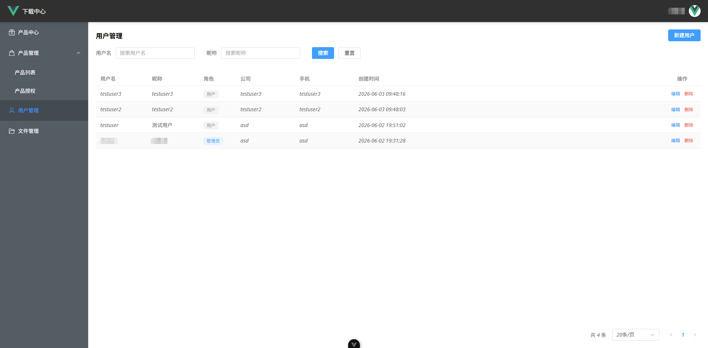

# DownloadCenter

ECU 控制器下载中心，管理员上传产品配套软件和说明书，用户登录后按产品浏览下载。

## 功能特性

- **产品管理** — 创建产品、上传封面图、发布/删除产品资源文件
- **文件管理** — 支持上传、下载、预览、删除，最大 100MB，按日期归档存储
- **用户管理** — 管理员创建用户，支持角色分配、密码修改
- **产品授权** — 按用户精细控制可见产品，支持"查看全部"开关 + 逐个授权
- **认证鉴权** — JWT 双 Token（AccessToken + RefreshToken），无状态，自动刷新
- **首次运行引导** — 系统检测无用户时自动引导注册管理员
- **Docker 一键部署** — 单镜像包含前后端，一条命令启动

## 截图预览

<!-- 截图待补充，放到 docs/images/ 目录下 -->

| 登录页 | 产品中心 |
|--------|---------|
|  |  |

| 产品管理 | 用户管理 |
|---------|---------|
|  |  |

## 技术栈

**后端**

- .NET 8 / ASP.NET Core Web API
- PostgreSQL + Entity Framework Core
- JWT 认证 + BCrypt 密码哈希
- Clean Architecture（Api / Application / Domain / Infrastructure / Shared）

**前端**

- Vue 3 + TypeScript + Vite
- Element Plus（按需引入）
- Pinia 状态管理 + Vue Router
- Axios（拦截器 + 401 自动刷新）

## 快速部署（Docker）

### 1. 克隆项目

```bash
git clone https://github.com/your-username/DownloadCenter.git
cd DownloadCenter
```

### 2. 准备配置文件

在项目根目录创建 `appsettings.json`，填写你的数据库和密钥配置：

```json
{
  "ConnectionStrings": {
    "DefaultConnection": "Host=你的数据库地址;Port=5432;Database=download_center;Username=postgres;Password=你的密码"
  },
  "Jwt": {
    "SecretKey": "你的密钥至少32个字符!!!!!!!!",
    "Issuer": "DownloadCenter",
    "Audience": "DownloadCenter",
    "AccessTokenExpirationMinutes": 30,
    "RefreshTokenExpirationDays": 7
  },
  "FileStorage": {
    "BasePath": "uploads",
    "MaxSizeBytes": 104857600,
    "AllowedExtensions": [".pdf", ".doc", ".docx", ".xls", ".xlsx", ".ppt", ".pptx", ".txt", ".csv", ".zip", ".rar", ".7z", ".jpg", ".jpeg", ".png", ".gif", ".bmp", ".svg"]
  }
}
```

### 3. 构建并启动

```bash
docker compose up -d
```

浏览器访问 `http://你的服务器IP`，首次运行会引导注册管理员账号。

## 本地开发

### 后端

```bash
cd src/DownloadCenter.Api
# 创建 appsettings.Development.json，填写本地数据库配置
dotnet run
```

后端默认运行在 `http://localhost:5157`

### 前端

```bash
cd ui
npm install
npm run dev
```

前端默认运行在 `http://localhost:5173`，已配置代理转发 `/api` 到后端。

## 项目结构

```
DownloadCenter/
├── src/                          # 后端（.NET 8）
│   ├── DownloadCenter.Api/       # API 层（Controller、中间件、启动配置）
│   ├── DownloadCenter.Application/ # 应用层（Service、DTO）
│   ├── DownloadCenter.Domain/    # 领域层（实体、枚举）
│   ├── DownloadCenter.Infrastructure/ # 基础设施层（EF Core、数据库配置）
│   └── DownloadCenter.Shared/    # 共享层（通用模型、JWT、雪花ID）
├── ui/                           # 前端（Vue 3 + TypeScript）
├── Dockerfile                    # Docker 多阶段构建
├── docker-compose.yml            # Docker 编排
└── appsettings.json              # 配置模板（占位符）
```

## 配置说明

| 配置项 | 说明 |
|--------|------|
| `ConnectionStrings:DefaultConnection` | PostgreSQL 连接字符串 |
| `Jwt:SecretKey` | JWT 签名密钥，至少 32 个字符 |
| `Jwt:Issuer` | JWT 签发者 |
| `Jwt:Audience` | JWT 受众 |
| `Jwt:AccessTokenExpirationMinutes` | AccessToken 过期时间（分钟） |
| `Jwt:RefreshTokenExpirationDays` | RefreshToken 过期时间（天） |
| `FileStorage:BasePath` | 文件存储目录 |
| `FileStorage:MaxSizeBytes` | 单文件最大字节数 |
| `FileStorage:AllowedExtensions` | 允许上传的文件扩展名 |

## 开源许可

[MIT License](LICENSE)
